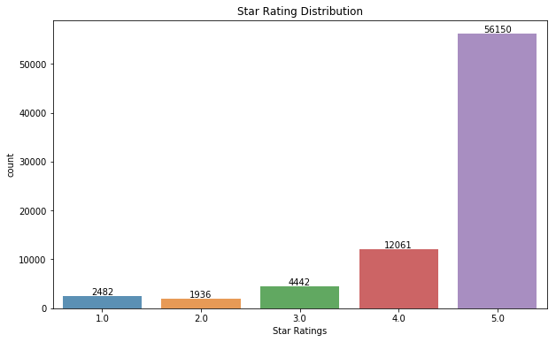

# Binary review classification with text mining 
## 1. Introduction
This is an open-ended project which starts from exploratory data analysis (EDA) of basic statistics and properties, reports findings of interests. Then identify a predictive task that can be studied on this dataset. Define the measurements of model performance at this predictive task and set a baseline model. Next, come up with suitable machine learning models and make optimization. Finally, compare the results and make conclusion.
* [Dataset](#dataset)
* [Exploratory Data Analysis](#eda)
* [Predictive task](#predictivetask)
  * [Baseline: Latent-factor model](#baseline)
* [Feature engineering](#feature)
  * [Bag of words: unigram and bigram](#bag)
  * [TF-IDF vectorizer](#tfidf)
  * [Dimensionality reduction: SVD/LSA](#lsa)
* [Machine learning models](#ml) 
  * [Naive Bayes](#bayes)
  * [Logistic Regression](#lr)
  * [Random Forest](#rf)
* [Conclusion](#conclusion)

## 2. Dataset<a name="dataset"></a>
This dataset comes from github page containing **Amazon Review Data** created by
[Jianmo Ni](https://nijianmo.github.io/amazon/index.html). Considering the computation cost and training time, I will simply use the 5-core (77,071 reviews) **Industrial and Scientific** category from **"Small" subsets for experimentation**, which can be found at the lower part of the page. 

**Sample data format: JSON**
```python
{
  "reviewerID": "A2SUAM1J3GNN3B",
  "asin": "0000013714",
  "reviewerName": "J. McDonald",
  "vote": 5,
  "style": {
    "Format:": "Hardcover"
  }
  "reviewText": "I bought this for my husband who plays the piano.  He is having a wonderful time playing these old hymns.  The music  is at times hard to read because we think the book was published for singing from more than playing from.  Great purchase though!",
  "overall": 5.0,
  "summary": "Heavenly Highway Hymns",
  "unixReviewTime": 1252800000,
  "reviewTime": "09 13, 2009"
}
```
- `reviewerID` - ID of the reviewer, e.g. A2SUAM1J3GNN3B
- `asin` - ID of the product, e.g. 0000013714
- `reviewerName` - name of the reviewer
- `vote` - helpful votes of the review
- `style` - a disctionary of the product metadata, e.g., "Format" is "Hardcover"
- `reviewText` - text of the review
- `overall` - rating of the product
- `summary` - summary of the review
- `unixReviewTime` - time of the review (unix time)
- `reviewTime` - time of the review (raw)

## 3. Exploratory data analysis<a name="eda"></a>
To summarize the main characteristics of basic statistcs, such as mean, median, variance, I often make EDA with visual methods, such as histogram for counts, scatter plot for continuous statistics, etc.
### 3.1 Distribution histogram over rating

From the distribution of ratings, it is obviously more 5-star ratings and 4-star ratings than others. There is probably an **imbalanced distribution problem**.

### 3.2 Seasonality
In the context of product review data, it is important to figure out whether there exists seasonality or not. 

## 4. Predictive task<a name="predictivetask"></a>

- Imbalanced data problem
- (Text Mining) High dimensionality problem
Pre-analyzed ratings distribution histogram, count of reviews and average rating over month plot.

### 4.1 Baseline: Latent-factor model<a name="baseline"></a>

## 5. Feature engineering<a name="feature"></a>

### 5.1 Bag of words: unigram and bigram<a name="bag"></a>

### 5.2 TF-IDF vectorizer<a name="tfidf"></a>

### 5.3 Dimensionality reduction: SVD/LSA<a name="lsa"></a>

## 6 Machine learning models<a name="ml"></a>

### 6.1 Naive Bayes<a name="bayes"></a>

### 6.2 Logistic Regression<a name="lr"></a>

### 6.3 Random Forest<a name="rf"></a>

## 7 Conclusion<a name="conclusion"></a>

